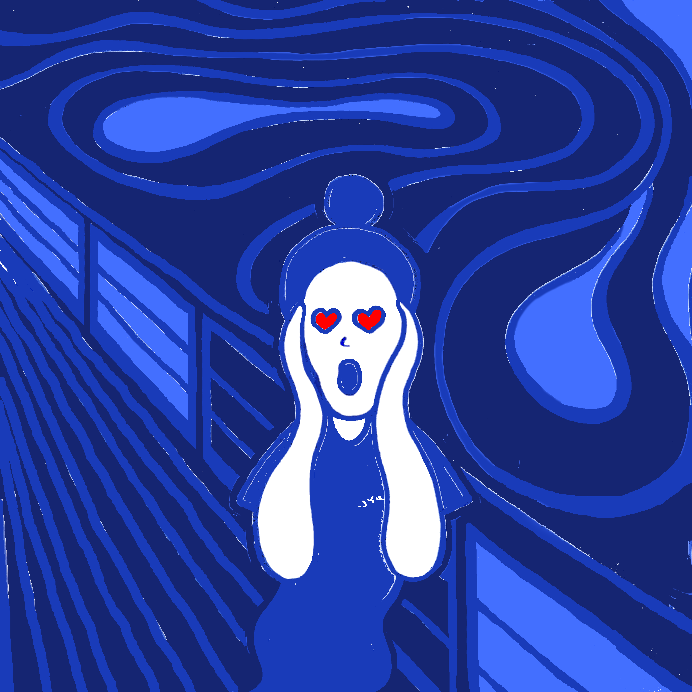

Here's my typical day.

|Working||
||Run a street stall in China?|
|Summer(Mosquito) night|| 
||How I look with 2 handrails on metro|
|Brain sport with metro handrails||
||How I look with a new follower|
|_ lives matter||
||Selfie|
|Two characters||

 

© 2018-2020 by YUQING JI

<a href="https://vjyq.github.io/en/about">About</a> | <a href="https://vjyq.github.io/">Blog</a> | <a href="mailto:yuqing.ji@outlook.com">Email</a> | <a href="https://github.com/vjyq">Github</a> | <a href="https://vjyq.github.io/zh">中文</a>
