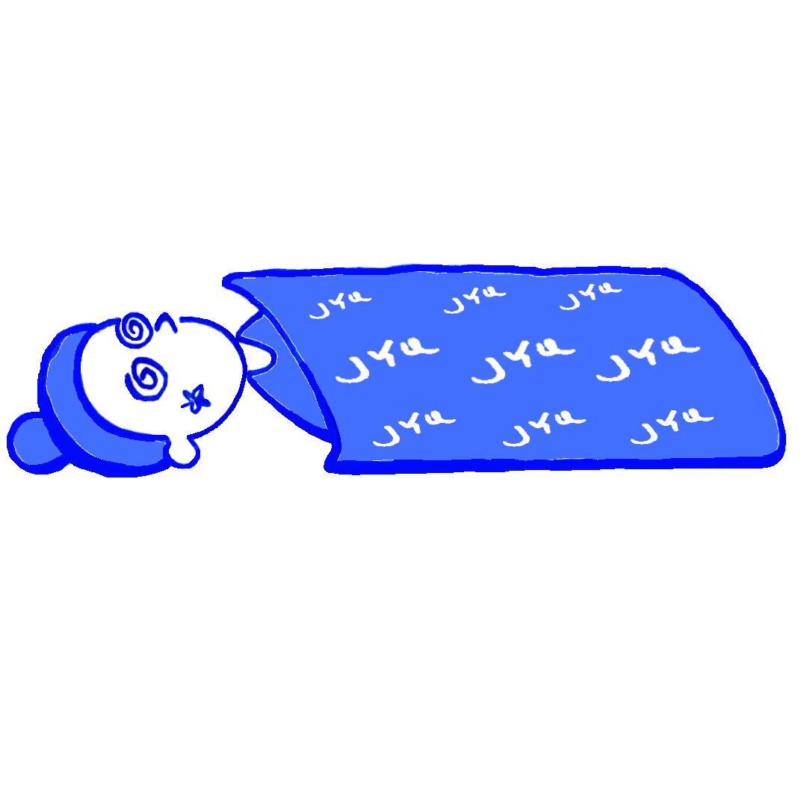
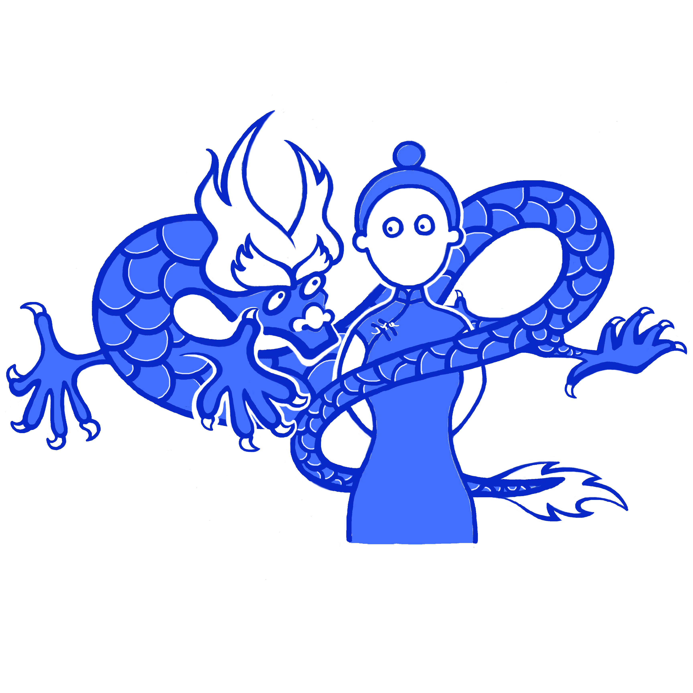

Here's my typical day.

|Hello world||
||Run a street stall in China?|
|Summer (mosquito) night|| 
||How I look with 2 handrails on metro|
|Brain sport with metro handrails||
||How I look with a new follower|
|_ lives matter||
||Selfie|
|Two characters||
||Debugging with stackoverflow|
|Fly me to the moon||
||Can only afford one bag with one month salary|
|Melting||
||Weekend|
|Gift||
||Maneki neko|
|Image||
||Thinking|
|Attention||
||大风起兮云飞扬|
|Mobius||
||Full|
|Running nose||
||Crossroads|
|Growing up||
||Outlier|
|Rainy||
||Makeup|
|Stay in bed||
||Tired|
|江天一色无纤尘，皎皎空中孤月轮||
||Bedtime|
|Me at 3 AM||
||Mojito|
|Out of power||
||Goal|
|The wall||
||Awake|
|Flower||
||Out of Battery|
|Against gravity||
||Friday night|
|Endpoints||

 

© 2018-2020 by YUQING JI

<a href="https://vjyq.github.io/en/about">About</a> | <a href="https://vjyq.github.io/">Blog</a> | <a href="mailto:yuqing.ji@outlook.com">Email</a> | <a href="https://github.com/vjyq">Github</a> | <a href="https://vjyq.github.io/zh">中文</a>
